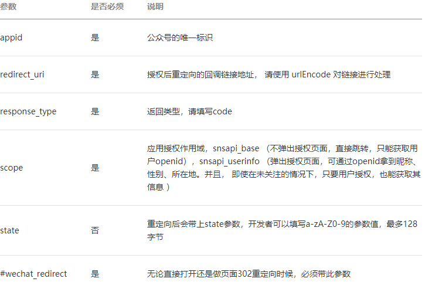

# taro基础项目
## 构建
- react-hooks、redux、typescript
## 启动
- h5 `npm run dev:h5`
## 依赖
- 组件库 taro-ui (版本3.0.0-alpha.7)

# 微信登录逻辑

- [官网地址](https://developers.weixin.qq.com/doc/offiaccount/OA_Web_Apps/Web_Developer_Tools.html)

- 两种模式 scope

  - 静默授权
    - **scope = snsapi_base** 发起的网页授权，是用来获取进行页面的用户的openid的，并且是静默授权并自动跳转到回调页。用户感知的就是直接进入了回调页(往往是业务页面)。
  - 手动授权同意
    - **scope = snsapi_userinfo** 发起的网页授权，是用来获取用户的基本信息，但这种授权需要用户手动同意，并且由于用户同意过，所以无需关注，就可在授权后获取该用户的基本信息。
  - <font color=red>注意</font> 用户管理类接口中的"获取用户基本信息接口"，是在用户和公众号产生消息交互或关注后推送后，才能根据用户 OpenId 来获取用户基本信息。这个接口，包括其他微信接口，都是需要该用户 (即openid) 关注了公众号后，才能调用成功的。

- ##### 关于网页授权 access_token 和普通 access_token 的区别

  - 微信网页授权是通过 OAuth2.0 机制实现的，在用户授权给公众号，公众号可以获取到一个网页特有的接口调用凭证(网页授权 access_token),通过网页授权 access_token 可以进行授权后接口调用，如获取用户基本信息;

- 用户授权同意，获取code

  - 打开连接 

  - ```javascript
    https://open.weixin.qq.com/connect/oauth2/authorize? appid=${公众号appid}& redirect_uri=${回调域名}&response_type=code& scope=snsapi_userinfo&state=STATE#wechat_redirect
    ```

  - 